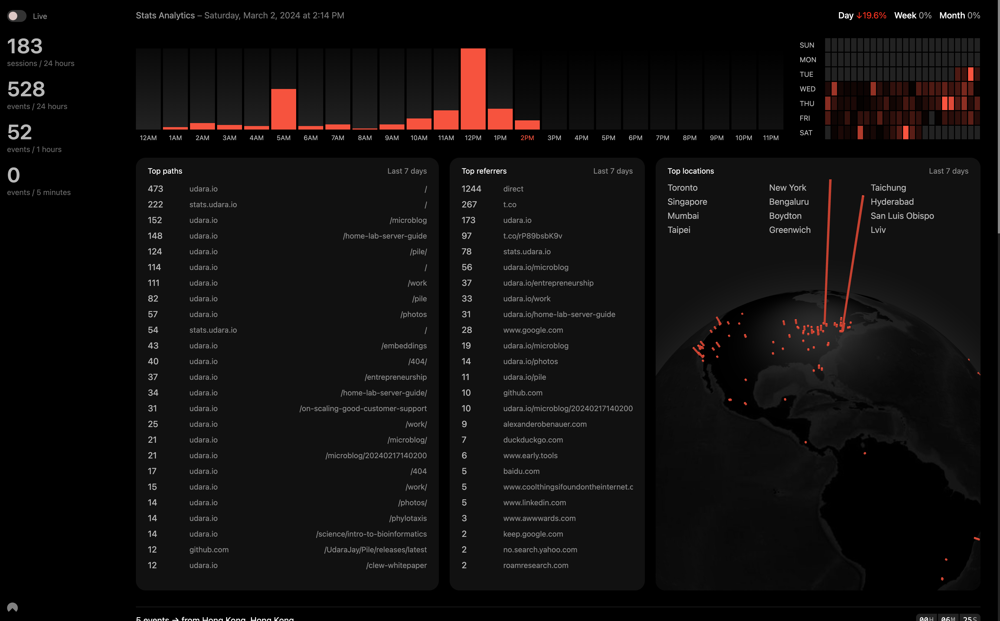

# Stats

Stats is a high-performance, standalone analytics provider designed for self-hosting, enabling the collection and viewing of event data from websites, apps, and more through a web API. It comes with a real-time dashboard and is ideal as a minimal and privacy-preserving analytics solution for small to medium traffic services.

**`Current status: it works, but it's not finished.`**



### Key-features
- Real-time analytics and dashboard
- Lightweight and efficient, with minimal resource usage
- Easy integration with websites, mobile apps, and other platforms

# Getting started

To get started with Stats, you'll need to compile an executable for your server, run it, and host it. While this guide focuses on using Nginx as a reverse proxy, Stats is versatile enough to be deployed in various environments, including Docker containers, for enhanced portability and scalability.

**Run in development-mode**

```
RUST_LOG=debug cargo run
```

**Build production release**

```
cargo build --release
```
This will create the executable file you need in the /target/release/ folder

**Embed events collector** <br/>
You use this to automatically collect pageviews or other events triggered by calling `stats_collect('event_name', 'optinal_url_override')` from javascript once the script below is initialized.

When you add this script to a new domain, you must add them to the `CORS_DOMAINS` list on the backend so the server can receive data from them.

```js
<script>
  // Stats analytics
  var head = document.head || document.getElementsByTagName("head")[0];
  var script = document.createElement("script");
  script.setAttribute("src", "http://localhost:5775/stats.js"); // REPLACE WITH ACTUAL URL
  script.setAttribute("onload", () => window.collectStats());
  script.setAttribute("type", "text/javascript");
  script.setAttribute("charset", "utf8");
  script.setAttribute("async", "");
  head.appendChild(script);
</script>
```

## Setup

Minimum set of folders & files required to run this application.

```
stats/
├── data/
│ ├── GeoLite2-City.mmdb
│ ├── cities5000.txt 
│ └── stats.sqlite 
├── ui/
├── stats // copy executable from target/release/stats
└── .env
```

# Configuration

These options must be defined in a `.env` file before starting the server. 

|  Variable | Default  | Summary  |
|---|---|---|
|  APP_URL | http://localhost:5775  | Full domain you are hosting this service on  |
|  SERVICE_PORT | 5775  | Port you want the service to be hosted from  |
|  DATABASE_URL | /data/stats.sqlite  | Path to .sqlite file to use as database.  |
|  CORS_DOMAINS | http://localhost:5775,https://udara.io  | Comma-separated list of allowed domains. The service will only accept analytics events from these domains.   |
|  PROCESSING_BATCH_SIZE | 500  | Max limit for events buffer used to queue and batch analytics events for processing. When the limit is hit, new events are dropped until items are processed from the queue. |


